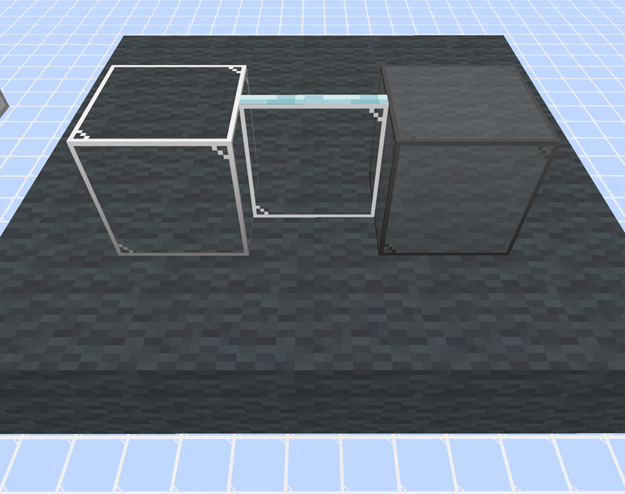

# Transparent Glass

A Minecraft resource pack that gives glass blocks and glass panes a simpler, more transparent appearance.

ガラスブロックや板ガラスのテクスチャを、よりシンプルで透明感のあるデザインに変更するマインクラフトのリソースパックです。

## Latest Release

1.24.2

## Java Edition

### Minecraft 26.1/26.1.1/26.1.2/26.2 or later

1. Download the resource pack from the `1.24.2` directory.

2. Place the downloaded file in your Minecraft `resourcepacks` folder.

On Windows, the default location is:

`C:\Users\<Username>\AppData\Roaming\.minecraft\resourcepacks`

### Minecraft 1.21.9/1.21.10/1.21.11

Use version 1.23.1 instead, available in the `1.23.1` directory.

### Older Minecraft versions

See the [Old Releases](OLD_RELEASES.md) for older versions of the resouce pack.

## Bedrock Edition

1.) Exit Minecraft.

2.) Download `TransparentGlass.mcpack` from the `1.24.2` directory.

3.) Double-Click or tap the downloaded file.

4.) Minecraft will launch and display the message `Import started...`.

5.) Wait until the message `Successfully imported 'Transparent Glass'` appears.

## Images

Glass / Glass Pane / Gray Stained Glass

